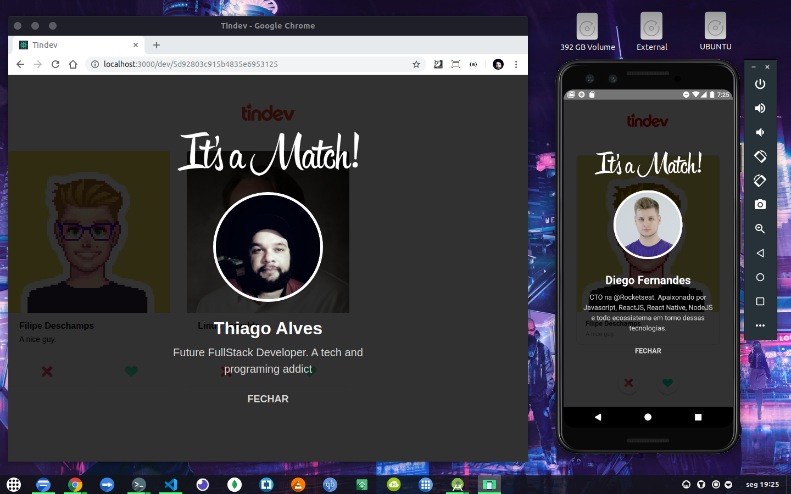

# Tindev
Aplicação baseada no Tinder porém, voltada à desenvolvedores cadastrados no Github. App criada na semana Omnistack 8.0.
 
# Tecnologias usadas: 
NodeJS/Backend, React/Web, React-native/Mobile.
 
Créditos: Rocketseat.

# 01 Aplicação Web.

 

# 02 Aplicação Mobile.

 

# 03 Aplicação Mobile e Web ambos logadas.

 

# 04 Função it's a match funcionando entre as duas plataformas.

 

